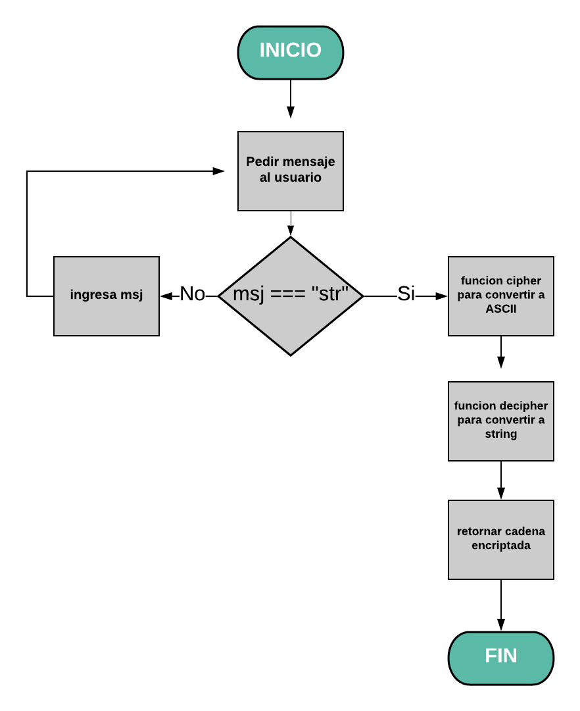

# CIFRADO CÉSAR
### ¿Qué es el CIFRADO CÉSAR?:
El cifrado César es uno de los primeros métodos de cifrado conocidos históricamente,
es un cifrado de sustitución en el que cada letra se reemplaza por otra y esta nueva letra
se obtiene al operar por un numero fijo,
Por ejemplo:

En el alfabeto la letra "A" tiene el valor de "0" y si se quiere desplazar 40 espacios a la derecha manualmente
nuestra nueva letra seria "O" ya que está corresponde a los desplazamientos indicados.
Existe una manera mas sencilla de saber cual seria nuestra nueva letra sin necesidad de desplazarnos una por una
y es mediante una fórmula:

## (x + n)% 26

"x" representa la posición de la letra.

"n" representa el valor fijo o el total de desplazamientos.

"% 26" representa el residuo de 26, ¿Por qué residuo de 26? por que 26 es la cantidad de letras de nuestro alfabeto.

Entonces si tomamos el ejemplo ya dado y lo representamos mediante la fórmula quedaria así:

(A + 40)% 26 = 14 que es la posición de la letra "O"

En las computadoras se utiliza el codigo ASCII para representar simbolos, caracteres y signos, lo que quiere decir que en codigo ASCII la primera letra del alfabeto se inicia en "65"

### Trabajo a realizar
-Crea una web que pida, por medio de un prompt(), una frase al usuario y devuelva el mismo mensaje encriptado según el algoritmo de Cifrado César con el parámetro de desplazamiento de 33 espacios hacia la derecha

Por ejemplo:

Texto original: ABCDEFGHIJKLMNOPQRSTUVWXYZ

Texto codificado: HIJKLMNOPQRSTUVWXYZABCDEFG

##### Consideraciones Específicas

-Tu programa debe ser capaz de cifrar y descifrar tanto letras mayúsculas como minúsculas. La fórmula para descifrar es: (x - n) % 26
Tu código debe estar compuesto por 2 funciones con los siguientes nombres: cipher y decipher
El usuario no debe poder ingresar un campo vacío o que contenga números.
## Pseudocódigo
1. Pedir por medio de un prompt() una frase al usuario.

2. Crear una funcion para validar que no sea numero, espacios o cadena  vacia.

3. Recorrer la cadena ingresada para validar que solo contenga letras por medio de un ciclo.

3. Hacer un arreglo donde se alamacenara la cadena.

4. Crear dos funciones llamadas cipher y decipher.

5. Iterar la cadena mediante charCodeAt() o String.fromCharCode() para convertir la cadena en en CIFRADO CÉSAR tomando en cuenta un parámetro de desplazamiento de 33 espacios hacia la derecha.

6. Retornar cadena encriptada en CIFRADO CÉSAR.

## Diagrama de flujo

